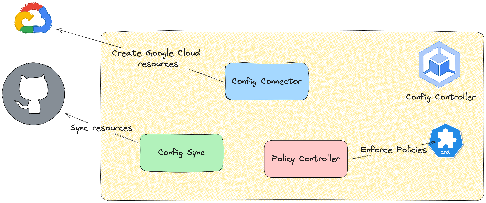

# gke-enterprise-self-service

This example shows the capabilities of GKE Enterprise along with [Port](https://getport.io) for a self-service experience to deliver automated and compliant GKE cluster provisioning.

The use of Port in this example is to provide a self-service portal that triggers GitHub Actions, and can be replaced with other IDP solutions that integrate with GitHub (ie. Backstage).

- [User Experience](#user-experience)
    - [Create Config Controller](#create-config-controller)
    - [Create GKE cluster](#create-gke-cluster)
- [Components](#components)
    - [Port](#port)
    - [Github Actions](#github-actions)
    - [Config Controller](#config-controller)
    - [Config Sync](#config-sync)
    - [Config Connector](#config-connector)
    - [Policy Controller](#policy-controller)

# User Experience

There are two self-service actions in this example that correspond to different components being provisioned in GKE. These self-service actions are designed to be lightweight for the user to request, and opinionated in how the downstream resources are configured and provisioned.


## Create Config Controller

- Users: Cluster Administrators
- Intention: Create a Config Controller instance in Google Cloud to host Config Connector resources

See below for more detail on [Config Controller](#config-controller).


## Create GKE cluster

- Users: Platform Engineers, Application Developers
- Intention: Create a GKE Cluster that is pre-installed with necessary security policies and required platform components


[](https://github.com/paulwilljones/gke-enterprise-self-service/pull/3)

# Components

## Port

[Port](https://getport.io) is an IDP that enables self-service and cataloguing of entities within Kubernetes and cloud environments.
Self-service Actions can be created that integrate with backends to trigger events upon invocation using the inputs provided by the user.
See some of the self-service actions in the [Port demo](https://demo.getport.io/self-serve).

The Port Actions in this example will be triggering GitHub Actions Workflows, so the user form will merely be taking inputs which will be passed to the GitHub Workflow in the invocation payload.

Our Port Actions are themselves configured through Terraform [here](./port/):

```sh
cd port
terraform init
terraform apply -var=port_client_id=me@example.com -var=port_client_secret=verysecret
```


## GitHub Actions

We will use different GitHub Actions that correspond to the Port Actions used when making self-service requests.

As mentioned, the inputs from the Port Action are passed to the GitHub Action Workflow and are therefore in scope when configuring the requested resources.

- [create-config-controller](./.github/workflows/create-config-controller-paulwilljones.yaml) will create a Config Controller instance and deploy a `RootSync` that configures Config Sync to reconcile resources from the repository
- [create-gke](./.github/workflows/create-gke.yaml) creates Config Connector manifests for the required resources to deploy a GKE cluster. These resources are then committed and a PR opened against the `main` branch (see [here](https://github.com/paulwilljones/gke-enterprise-self-service/pull/3) for an example). Upon these manifest being merged, Config Sync in the Config Controller cluster will sync the resources and Config Connector will start to reconcile the KCC resources with Google Cloud.

## Config Controller

A Config Controller instance is a GKE cluster that hosts managed instances of Config Sync, Config Connector and Policy Controller. Config Connector is designed to be a 'hub' cluster, which orchestrates the desired state of your Google Cloud environments through KCC resources. As such, there are managed `Constraints` deployed as part of Config Controller to limit the cluster's ability to run arbitrary workloads, and instead limit it's scope to being a managed instance of GKE Enterprise components.



In this example, a Port Action triggers a GitHub Workflow that creates a Config Controller instance. This hub cluster will host our KCC resources, so depending on how you want to organise what resources are managed within a hub cluster, there typically isn't a requirement to host multiple or many Config Controller clusters.

```yaml
#./.github/workflows/create-config-controller-paulwilljones.yaml
...
jobs:
  Config-Controller:
    runs-on: ubuntu-latest
    permissions:
      contents: 'read'
      id-token: 'write'
    steps:
      - uses: 'actions/checkout@v4'
      - uses: 'google-github-actions/auth@v2'
        with:
          project_id: 'jetstack-paul'
          workload_identity_provider: 'projects/1234567891234/locations/global/workloadIdentityPools/github/providers/paulwilljones'
      - name: 'Set up Cloud SDK'
        uses: 'google-github-actions/setup-gcloud@v2'
      - name: 'Create Config Controller'
        run: 'gcloud anthos config controller create ${{ inputs.name }} --location=${{ inputs.location }} --full-management'
...
```

> Note: at the time of writing, Config Controller instanaces can be deployed using `gcloud` or Config Connector resources ([`ConfigControllerInstance`](https://cloud.google.com/config-connector/docs/reference/resource-docs/configcontroller/configcontrollerinstance)).

> Note: Config Controller instances can be hosted on GKE Standard and Autopilot clusters. For Autopilot, the `--full-management` flag is passed to `gcloud anthos config controller create`.

## Config Sync

As a managed capability, Config Sync reconciles your desired state as defined in source control. Config Sync is a GKE Enterprise feature that can be enabled in GKE clusters via [`gcloud`](https://cloud.google.com/kubernetes-engine/enterprise/config-sync/docs/how-to/installing-config-sync#configuring-config-sync) or as a [GKE Hub Feature](https://cloud.google.com/kubernetes-engine/fleet-management/docs/reference/rest/v1/projects.locations.features#Feature), therefore it can be configured using [Terraform](https://cloud.google.com/kubernetes-engine/enterprise/config-sync/docs/how-to/installing-config-sync#terraform) or [Config Connector](https://cloud.google.com/config-connector/docs/reference/resource-docs/gkehub/gkehubfeaturemembership#config_management_feature_membership).

As part of Config Controller, Config Sync is already installed and just needs to be configured. This is done by deploying a `RootSync` resource that encapsulates the configuration and status of the reconciliation.

As part of the GitHub Workflow that creates the Config Controller instance, a `RootSync` is also deployed to configure Config Sync.

In our example, a `RootSync` pulls the [./user-clusters/](./user-clusters/) which will contain all the Config Connector resources that will be created and deleted later by GitHub Actions.

```yaml
apiVersion: configsync.gke.io/v1beta1
kind: RootSync
metadata:
    name: root-sync
    namespace: config-management-system
spec:
    sourceFormat: unstructured
    git:
    repo: https://github.com/paulwilljones/gke-enterprise-self-service
    branch: main
    dir: user-clusters
    auth: none
```

## Config Connector

Google Cloud resources can be managed through Config Connector (KCC) and the corresponding [Kubernetes resources](https://cloud.google.com/config-connector/docs/reference/overview). This allows for applications to be created along with the external dependencies in Google Cloud they need together in the same set of Kubernetes manifests. Config Connector reconciles the desired state as defined in Kubernetes with the observed state in Google Cloud, centralising the management of cloud resources through GKE.

KCC can also create `ContainerClusters` which itself will manage the lifecycle of GKE clusters as well as other dependencies like VPCs, IAM resources and even configuring Config Sync in the newly provisioned cluster.

In our deployment, Config Controller uses Config Sync to pull KCC resources from a repository. These KCC resources include a `ContainerCluster` and `ComputeNetwork` which will be used by Config Connector to provision a new GKE cluster and VPC. In addition to these, a couple of GKE Hub resources are deployed (`GKEHubMembership` and `GKEHubFeatureMembership`) which registers the cluster and configures Config Sync. This creates a powerful pattern for bootstrapping clusters with all the necessary policies and components required as part of provisioning.

```yaml
---
# Source: gke-autopilot/templates/computenetwork.yaml
apiVersion: compute.cnrm.cloud.google.com/v1beta1
kind: ComputeNetwork
metadata:
  name: my-cluster
  namespace: config-control
spec:
  routingMode: REGIONAL
  autoCreateSubnetworks: true
---
# Source: gke-autopilot/templates/containercluster.yaml
apiVersion: container.cnrm.cloud.google.com/v1beta1
kind: ContainerCluster
metadata:
  name: my-cluster
  namespace: config-control
spec:
  description: An autopilot cluster.
  enableAutopilot: true
  location: europe-west1
  releaseChannel:
    channel: REGULAR
  networkRef:
    name: my-cluster
  subnetworkRef:
    external: my-cluster
---
# Source: gke-autopilot/templates/gkehubfeaturemembership.yaml
apiVersion: gkehub.cnrm.cloud.google.com/v1beta1
kind: GKEHubFeatureMembership
metadata:
  name: my-cluster
  namespace: config-control
  annotations:
    config.kubernetes.io/depends-on: "gkehub.cnrm.cloud.google.com/namespaces/config-control/GKEHubMembership/my-cluster"
spec:
  projectRef:
    external: jetstack-paul
  location: global
  membershipRef:
    name: my-cluster
  featureRef:
    name: gkehubfeature-acm
  configmanagement:
    configSync:
      sourceFormat: unstructured
      git:
        syncRepo: https://github.com/paulwilljones/gke-enterprise-self-service
        syncBranch: main
        policyDir: root-syncs
        syncWaitSecs: "20"
        syncRev: "HEAD"
        secretType: none
    policyController:
      enabled: true
      exemptableNamespaces:
        - "kube-system"
      referentialRulesEnabled: true
      logDeniesEnabled: true
      templateLibraryInstalled: true
      auditIntervalSeconds: "20"
    hierarchyController:
      enabled: false
---
# Source: gke-autopilot/templates/gkehubmembership.yaml
apiVersion: gkehub.cnrm.cloud.google.com/v1beta1
kind: GKEHubMembership
metadata:
  annotations:
    cnrm.cloud.google.com/project-id: jetstack-paul
    config.kubernetes.io/depends-on: "container.cnrm.cloud.google.com/namespaces/config-control/ContainerCluster/my-cluster"
  name: my-cluster
  namespace: config-control
spec:
  location: global
  authority:
    issuer: "https://container.googleapis.com/v1/projects/jetstack-paul/locations/europe-west1/clusters/my-cluster"
  endpoint:
    gkeCluster:
      resourceRef:
        name: my-cluster
```

> Note: as part of the GitHub Actions automation, these resources are generated using a Helm chart ([`./charts/gke-autopilot`](./charts/gke-autopilot/) by using `helm template` with the rendered manifests then committed and a PR raised to merge them into `./user-clusters`. The resources in this directory are then pulled by Config Sync in the Config Controller cluster.

In the spoke clusters, we configure Config Sync to pull [`./root-syncs`](./root-syncs/) which itself contains more `RootSync` resources to manage multiple syncs. In these, we are pulling Policy Controller `Constraints` that are bundled to form different sets of policies that correspond to different industry standards for security and best practices (see [Policy Controller bundles](https://cloud.google.com/kubernetes-engine/enterprise/policy-controller/docs/concepts/policy-controller-bundles) for more).

```yaml
# root-syncs/cis-gke-v1.5.0.yaml
apiVersion: configsync.gke.io/v1beta1
kind: RootSync
metadata:
  name: cis-gke-v1-5-0
  namespace: config-management-system
spec:
  sourceFormat: unstructured
  git:
    repo: https://github.com/GoogleCloudPlatform/gke-policy-library
    branch: main
    dir: "anthos-bundles/cis-gke-v1.5.0"
    auth: none
```

## Policy Controller

To ensure that policies are enforced in accordance with the standards set by the organisation and compliance requirements, Policy Controller is a managed Gatekeeper deployment that uses `Constraints` to validate resources during admission.

As mentioned, we are using Config Sync to deploy `Constraints` as part of a set of policy bundles. This ensures that as part of cluster provisioning, clusters are bootstrapped with all the requisite controls and policies _before_ they are made available to tenants.

# References

- GKE Enterprise
    - https://cloud.google.com/kubernetes-engine/enterprise/docs/concepts/overview
- Config Connector
    - https://cloud.google.com/config-connector/docs/overview
- Config Sync
    - https://cloud.google.com/kubernetes-engine/enterprise/config-sync/docs/overview
- Config Controller
    - https://cloud.google.com/kubernetes-engine/enterprise/config-controller/docs/overview
- Port
    - https://docs.getport.io/
